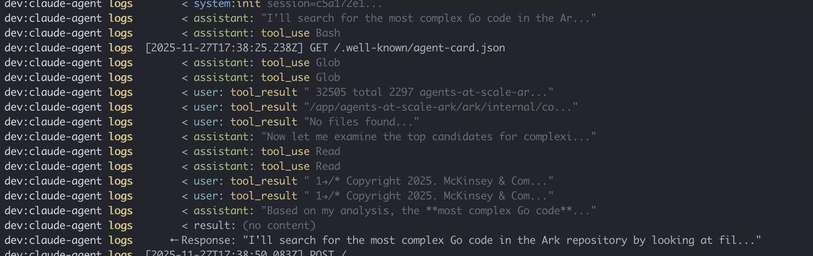

<p align="center">
  <h1 align="center"><code>claude-code-agent</code></h1>
  <h4 align="center">Run Claude Code as a containerized A2A agent</h4>
  <p align="center">
    <a href="#quickstart">Quickstart</a> |
    <a href="#deploy">Deploy</a> |
    <a href="#configuration">Configuration (MCP, Skills, etc)</a> |
    <a href="#examples">Examples</a>
    <a href="#important">Important - Managing Risk</a>
  </p>
  <p align="center">
    <a href="https://github.com/dwmkerr/claude-code-agent/actions/workflows/cicd.yaml"></a>
    <a href="https://www.npmjs.com/package/@dwmkerr/claude-code-agent"></a>
    <a href="https://github.com/dwmkerr/claude-code-agent/pkgs/container/claude-code-agent"></a>
    <a href="https://codecov.io/gh/dwmkerr/claude-code-agent"></a>
  </p>
</p>

<p align="center">
  
</p>

This project lets you deploy and run the Claude Code agent as a self-contained A2A server. This allows you to deploy Claude Code to different environments and interact with it using a standardised protocol. Isolated workspaces, skills, and various other capabilities can easily be extended.

I am using this agent extensively in my work on [Ark](https://github.com/agents-at-scale-ark) - there are examples on how to build skills, use K8S, playwright, and more, in [`./examples/ark`](./examples/ark).

## Quickstart

Run the Claude Code Agent A2A server locally (check [important note on managing risk](#important):

```bash
# Set your API key.
export ANTHROPIC_API_KEY="sk-***"

# Alternatively, use a .env file.
# cp .env.sample .env  # now set your key.

# Run in local development / live reload mode.
npm install && npm run dev

# SAFER: Run in local development / live reload mode - but don't inherit the
# user's environment (e.g. sensitive env vars not accessible to claude).
make dev-safe
# Server: http://localhost:2222
# or:
# env -i npm run dev
```

Or run in a container (event safer and more isolated):

```bash
# Run in a container. Also loads the .env file if present.
make docker-run
# Server: http://localhost:2222
```

Send an A2A message. You'll see rich output in the A2A server in real time:

```bash
./scripts/a2a-msg.sh "Tell me what tools you have access to, test one out."
```

This is a simple wrapper around `curl` - you can also just hit the server directly:

```bash
curl -N -X POST http://localhost:2222/ \
  -H "Content-Type: application/json" \
  -d @- << 'EOF'
{
  "jsonrpc": "2.0",
  "method": "message/stream",
  "params": {
    "message": {
      "messageId": "1",
      "contextId": "ctx-1",
      "role": "user",
      "parts": [{"kind": "text", "text": "Tell me what skills you have loaded."}]
    }
  },
  "id": 1
}
EOF
```

Open with A2A Inspector:

```bash
git clone https://github.com/a2aproject/a2a-inspector
cd a2a-inspector && ./scripts/run.sh
# Connect to http://localhost:2222
```

Run on [Ark](https://github.com/mckinsey/agents-at-scale-ark):

```bash
# Install ark.
npm install -g @agents-at-scale/ark
ark install

# Either install the agent...
helm install claude-code-agent oci://ghcr.io/dwmkerr/charts/claude-code-agent --set apiKey=$ANTHROPIC_API_KEY
# ...or run in the cluster with live-reload
devspace dev

# Check the status of the a2a server and claude code agent.
kubectl get a2aserver
kubectl get agent

# Run the ark dashboard and chat, send a single message, or run the interactive
# chat in the terminal.
ark dashboard
ark query agent/claude-code 'hi'
```

## Deploy

**Docker**

```bash
docker run -e ANTHROPIC_API_KEY=$ANTHROPIC_API_KEY -p 2222:2222 \
  ghcr.io/dwmkerr/claude-code-agent
```

**Helm**

```bash
helm install claude-code-agent oci://ghcr.io/dwmkerr/charts/claude-code-agent \
  --set apiKey=$ANTHROPIC_API_KEY
```

**DevSpace**

```bash
devspace dev
devspace dev -p ark  # Ark example with DinD for Kind clusters
```

## Configuration

All options are documented in [`claude-code-agent.example.yaml`](./claude-code-agent.example.yaml). Environment variables from `.env` are loaded on startup (overriding existing vars). The config file `.claude-code-agent.yaml` is loaded by default if present.

```bash
claude-code-agent [options] [-- <claude-code-args>]

Options:
  -p, --port <number>      Server port (default: 2222)
  -H, --host <string>      Server host (default: 0.0.0.0)
  -w, --workspace <path>   Workspace directory
  -c, --config <path>      Path to YAML config file
  --timeout <seconds>      Execution timeout (default: 3600)
  --log-path <path>        Path to write Claude output logs
  --agent-name <name>      Agent name for A2A registration

# Pass any Claude Code args after --
claude-code-agent -- --mcp-config /config/mcp.json --allowedTools Bash,Read
```

### Environment Variables

| Variable | Description | Default |
|----------|-------------|---------|
| `ANTHROPIC_API_KEY` | API key (required) | - |
| `CLAUDE_TIMEOUT_SECONDS` | Execution timeout | `3600` |
| `CLAUDE_CODE_WORKSPACE_DIR` | Working directory | `./workspace` (local) or `/workspace` (docker/helm) |
| `CLAUDE_AGENT_NAME` | Agent name for A2A registration | `claude-code` |
| `CLAUDE_LOG_PATH` | File path for JSONL chunk logs | - (disabled) |
| `HOST` | Server host | `0.0.0.0` |
| `PORT` | Server port | `2222` |
| `FORCE_COLOR` | Enable colors in logs | `1` |

CLI options override environment variables.

### Workspace

Claude operates in `./workspace` locally or `/workspace` in containers. Override with `CLAUDE_CODE_WORKSPACE_DIR`.

```bash
# Mount a specific folder rather than the local ./workspace folder.
CLAUDE_CODE_WORKSPACE_DIR=/tmp/project1 npm run dev

# Docker - mount a local workspace. This folder is automatically mounted when
# make docker-run is used.
docker run -v ./workspace:/workspace ...

# Helm - enable persistence (creates PVC)
helm install ... --set workspace.persistence.enabled=true
```

### Tools

Claude code runs in a container, with a number of tools such as `curl`, `wget`, etc installed. Check these tools or extend by editing [`Dockerfile`](./Dockerfile).

If tools require configuration, config files or env vars can be passed to the container. For example, to ensure that the `gh` CLI can be used, pass a `GH_TOKEN` by either setting in `.env` or explicitly pass the environment variable. See the [important note on risk](#important).

### MCP Servers

Configure MCP servers by passing `--mcp-config` via the CLI passthrough:

```bash
# Docker - mount config and pass to Claude
docker run -v ./mcp.json:/config/mcp.json:ro \
  ... claude-code-agent -- --mcp-config /config/mcp.json

# Example mcp.json
{
  "mcpServers": {
    "playwright": {
      "type": "stdio",
      "command": "npx",
      "args": ["@playwright/mcp@latest"]
    }
  }
}
```

> **Note:** Mount the config to a separate location (e.g., `/config/`) rather than directly to `~/.claude.json`. Mounting directly to the Claude home directory can cause permissions issues since Claude Code needs to write to that location.

See [`examples/ark/`](./examples/ark/) for a complete example with MCP servers.

### Telemetry (OpenTelemetry)

Enable OTEL tracing by setting `CLAUDE_CODE_ENABLE_TELEMETRY=1`:

```bash
# Docker
docker run -e CLAUDE_CODE_ENABLE_TELEMETRY=1 \
  -e OTEL_EXPORTER_OTLP_ENDPOINT=http://phoenix:6006 ...

# Helm
helm install ... --set env.CLAUDE_CODE_ENABLE_TELEMETRY=1

# With envFrom for OTEL secrets (e.g., from Phoenix)
helm install ... \
  --set env.CLAUDE_CODE_ENABLE_TELEMETRY=1 \
  --set envFrom[0].secretRef.name=otel-environment-variables \
  --set envFrom[0].secretRef.optional=true
```

### Claude Configuration

Optionally mount config files to `/home/claude-code-agent/.claude-defaults/`:

```
.claude-defaults/    # Will be copied to ~/.claude on startup
├── settings.json    # Settings, plugins, MCP servers
├── CLAUDE.md        # Instructions
├── commands/        # Custom slash commands
└── skills/          # User skills (see Skills section below)
```

Claude Code writes to `~/.claude/` during operation, so direct mounts can fail due to permissions or corrupt your local files. The `claude-defaults` directory provides a safer approach - files are copied on startup.

## Skills

Claude Code loads skills from two locations:

- **User skills**: `~/.claude/skills/` - Global skills, always available
- **Project skills**: `workspace/.claude/skills/` - Repo-specific skills

For containers, mount skills to the user directory:

```bash
# Docker - mount skills to user directory
docker run -v /path/to/skills:/home/claude-code-agent/.claude/skills:ro ...

# See examples/ark/ for a complete example with skills
cd examples/ark && make run
```

## Examples

See [`examples/`](./examples/) for usage examples:

- **[Ark Testing](./examples/ark/)** - Test Ark PRs with Kind clusters, MCP servers (Playwright), and skills

## API

Implements [A2A protocol](https://github.com/google/A2A):

- `GET /.well-known/agent-card.json` - Agent metadata
- `POST /` - JSON-RPC messages
- `GET /health` - Health check

## Development

```bash
npm install
npm run dev      # Development with hot-reload
npm test         # Run tests
npm run build    # Build for production
```

### Docker Images

Releases push to GHCR (`ghcr.io/dwmkerr/claude-code-agent`). For local development, push release candidates to Docker Hub:

```bash
# Build and push base image RC
docker build -t dwmkerr/claude-code-agent-base:0.1.2-rc1 -f Dockerfile.base .
docker push dwmkerr/claude-code-agent-base:0.1.2-rc1

# Update Dockerfile and devspace.yaml to use the RC tag, then iterate
```

### Testing with Minikube

```bash
docker build -t claude-code-agent:local .
minikube image load claude-code-agent:local
helm install claude-code-agent ./chart \
  --set image.repository=claude-code-agent \
  --set image.tag=local \
  --set image.pullPolicy=Never \
  --set apiKey=$ANTHROPIC_API_KEY
```

## Test Prompts

> Clone the mckinsey/agents-at-scale-ar repo, build a file called 'issues.md' that has a table of issues/urls/ids/titles and a one line summary for each one. Then suggest a good first issue to work on.

> Check out https://github.com/mckinsey/agents-at-scale-ark/pull/531 and test it you need to use ark setup to setup your environment and ark-testing to c heck the dashboard. save screenshots to ./screenshots and let me know when done

## Important

Be aware that if you run the agent as a local process with `npm`, then it will inherit your environment. This presents a *significant* security risk - for example if you are logged into the GitHub CLI (`gh`) then the agent will be able to execute GitHub commands with your identity, via the `Bash` tool.

It is highly recommended that you run the agent in a docker container with `make docker-run` or by checking the [Deploy](#deploy) guide. You can also use `make dev-safe`. Use `make help` for all recipes.
