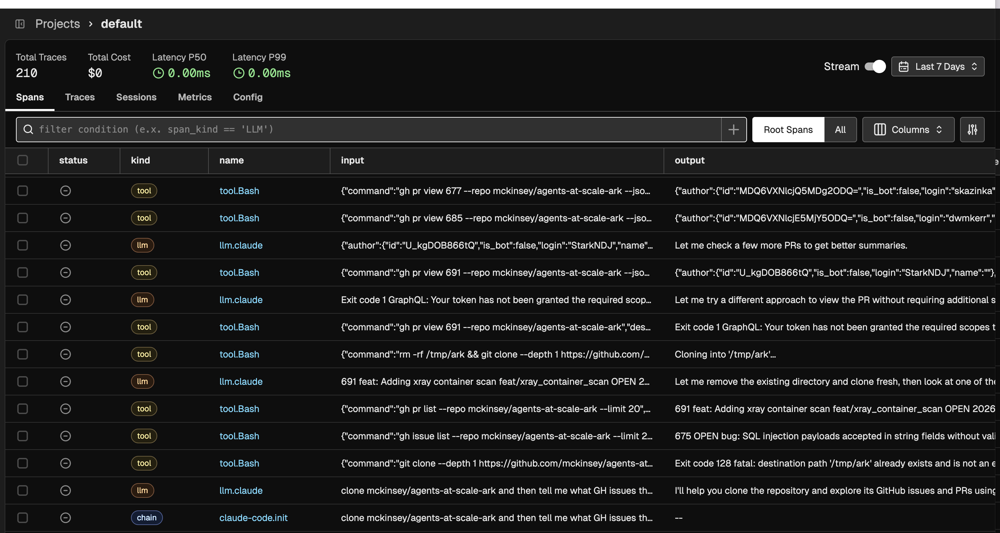
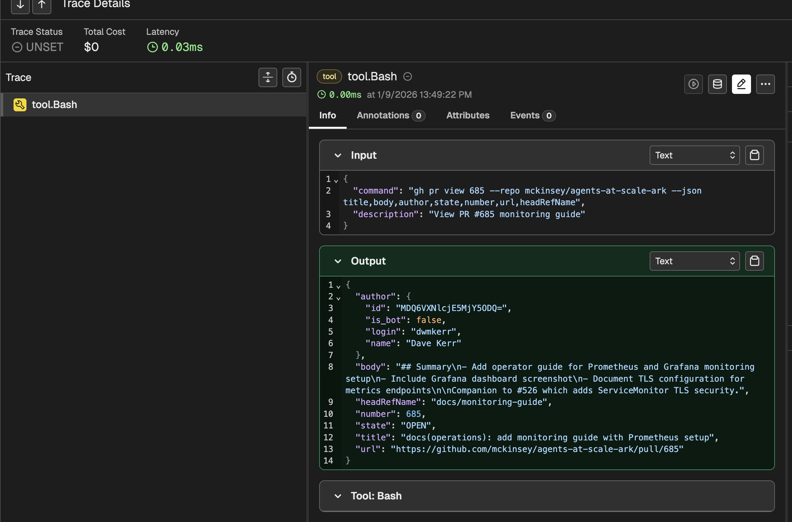

# OpenTelemetry

Claude Code has built-in OpenTelemetry support for metrics and events. Enable it with:

```bash
CLAUDE_CODE_ENABLE_TELEMETRY=1
OTEL_EXPORTER_OTLP_ENDPOINT=http://localhost:4317
OTEL_EXPORTER_OTLP_PROTOCOL=grpc
```

This exports metrics and events via standard OTEL protocol. See the [Claude Code docs](https://docs.anthropic.com/en/docs/claude-code) for details.

## Experimental: OTEL Traces

> **Work in Progress**: This feature is experimental and under active development.

The A2A server adds real-time tracing for LLM calls and tool invocations. Spans are exported as they occur, giving visibility into the agentic loop.





### Configuration

Enable tracing in your config file (`.claude-code-agent.yaml` or via `-c`):

```yaml
otel:
  tracing:
    enabled: true
    inputMode: "chained"    # or "full"
    aggregateSpans: false
```

Set the OTEL endpoint via environment variable:

```bash
OTEL_EXPORTER_OTLP_ENDPOINT=http://localhost:6006
```

### Input Modes

- **chained** (default): Each span's input is the previous span's output. Simple visualization of the agentic loop.
- **full**: Input includes the complete conversation history in OpenInference format (`llm.input_messages`). Shows true LLM input but more verbose.

### Aggregate Spans Mode

When `aggregateSpans: true`, all spans are nested under a single parent span per A2A message.

**Limitation**: Parent spans only complete when the entire operation finishes, so you won't see traces until the task completes. For real-time visibility, keep this `false` (default).

### Development

Use the provided dev config:

```bash
OTEL_EXPORTER_OTLP_ENDPOINT=http://localhost:6006 npm run dev:otel-unsafe
```

This uses `claude-code-agent.otel-unsafe.yaml` with tracing enabled.
