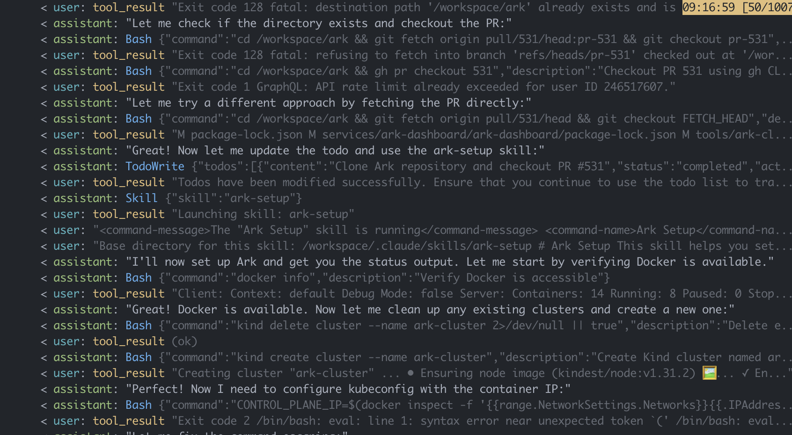

# Ark Testing Example

Use the Claude Code Agent for testing [Ark](https://github.com/mckinsey/agents-at-scale-ark) pull requests:

- Creates Kubernetes clusters and can install/setup Ark
- Able to analyse the codebase in detail using specialised skills
- Can test Ark by running the dashboard and driving it with Playwright taking screenshots along the way

## Setup

The agent needs Docker access to create Kind clusters.

```bash
# Run in a container, mount skills, config, mcp, expose 2222.
make docker-run-ark

# Live reload in a k8s cluster with DinD for Kind.
devspace dev -p ark

# Install with helm.
# TODO: note that we'd have to copy over the claude/ files.
helm install claude-code-agent ./chart \
  -f examples/ark/values-dind.yaml \
  --set apiKey=$ANTHROPIC_API_KEY
```

## Claude Configuration

This example includes Claude config in `examples/ark/claude/`:

```
# TODO make up to date
.claude.json       # MCP config, eg playwright (mounted from ./.claude.json).
# All the files below mounted from ./claude folder.
CLAUDE.md          # System prompt additions with critical instructions
skills/            # Skills for Ark workflows:
  /ark-setup       # Set up Ark from source with Kind
  /ark-testing     # Test dashboard UI with Playwright
  /ark-analysis    # Analyze Ark codebase and issues
```

The `claude` folder is copied to `~/.claude/` on startup.

## Examples

### Setup an entire Ark Cluster running a Pull Request

Use the `Ark Setup` skill to create a Kubernetes Cluster, install Ark from a pull request branch, validate that all services are running correctly.

Running the Query:

```bash
ark query agent/ark-claude-code-agent "Check out https://github.com/mckinsey/agents-at-scale-ark/pull/531 and use the ark-setup skill to install ark and give me the output of 'ark status'"
```


TODO can we make this a collapse block call 'Bash'

```bash
query="Check out https://github.com/mckinsey/agents-at-scale-ark/pull/531 and use the ark-setup skill to install ark and give me the output of 'ark status'"

curl -N -X POST http://localhost:2222/ \
  -H "Content-Type: application/json" \
  -d @- << EOF
{
  "jsonrpc": "2.0",
  "method": "message/stream",
  "params": {
    "message": {
      "messageId": "1",
      "contextId": "ctx-1",
      "role": "user",
      "parts": [{
        "kind": "text",
        "text": "${query}"
      }]
    }
  },
  "id": 1
}
EOF
```

Snapshot of Claude Code:



Final Result:

```
## Ark Status Summary

  **Cluster Access:**
  - ✓ Connected to: kind-ark-cluster (172.18.0.2)

  **Ark Services:**
  - ✓ ark-tenant: healthy (v0.1.46, deployed)
  - ✓ ark-api: healthy (v0.1.46, 1/1 replicas ready)
  - ✓ ark-dashboard: healthy (v0.1.46, 1/1 replicas ready)
  - ○ ark-mcp: not ready (0/1 replicas ready)
  - ○ ark-cluster-memory: not ready (0/1 replicas ready)

  **Ark Status:**
  - ✓ ark-controller: ready (v0.1.46, 1/1 replicas ready)
  - ✓ Version: up to date (0.1.46)

  Duration: 508s (~8.5 min), Cost: $0.38
```


For analysis, this snippet.

```bash
query="Check out https://github.com/mckinsey/agents-at-scale-ark/pull/531 and use the ark-analysis skill to build a suggested implementation plan"

curl -N -X POST http://localhost:2222/ \
  -H "Content-Type: application/json" \
  -d @- << EOF
{
  "jsonrpc": "2.0",
  "method": "message/stream",
  "params": {
    "message": {
      "messageId": "1",
      "contextId": "ctx-1",
      "role": "user",
      "parts": [{
        "kind": "text",
        "text": "${query}"
      }]
    }
  },
  "id": 1
}
EOF
```


Or with Ark Query resource:

```bash
# Check agents exist.
kubectl get a2aserver
kubectl get agents

kubectl apply -f - <<EOF
apiVersion: ark.mckinsey.com/v1alpha1
kind: Query
metadata:
  name: test-query
spec:
  targets:
    - kind: Agent
      name: claude-code-agent
  input:
    - role: user
      content: "${query}"
EOF

# Watch query status
kubectl get query test-query -w
```

## Debugging

```bash
# View chunk logs from make docker-run-ark (if CLAUDE_LOG_PATH was set)
# Log is JSONL format (one JSON object per line)
docker exec $(docker ps --filter ancestor=claude-code-agent -q) cat /tmp/claude-code-agent-log.jsonl

# Show MCP servers.
docker exec $(docker ps --filter ancestor=claude-code-agent -q) claude mcp list
```
