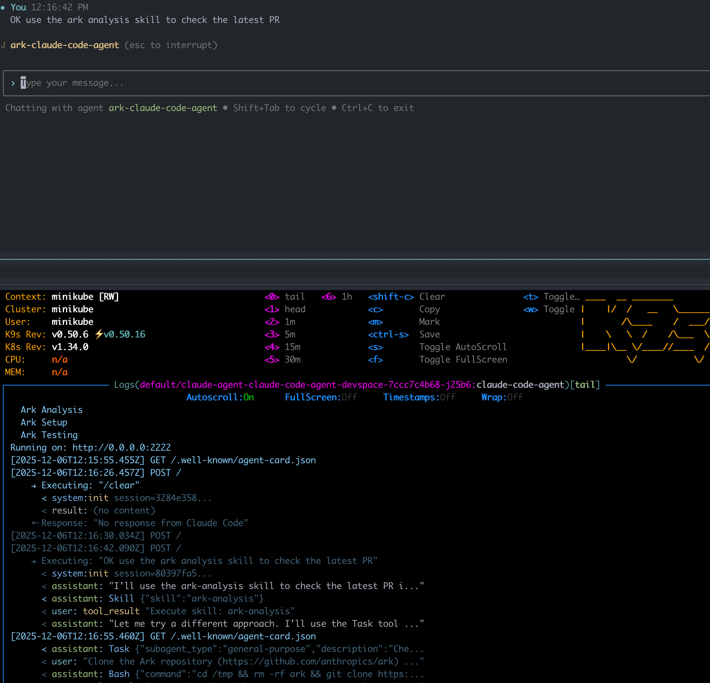

# Ark Testing Example

Claude Code Agent for testing [Ark](https://github.com/mckinsey/agents-at-scale-ark) pull requests - creates K8s clusters, installs Ark, and takes screenshots of UI changes.



## Quickstart

```bash
cd examples/ark
devspace dev
```

## What It Does

1. Checks out a PR branch
2. Creates a Kind cluster
3. Installs Ark from source
4. Runs Playwright to screenshot dashboard changes

## Examples

Setup Ark from a PR and show status:

```bash
ark query agent/ark-claude-code-agent \
  'Checkout https://github.com/mckinsey/agents-at-scale-ark/pull/531, use ark-setup skill to install and show ark status'
```

Screenshot dashboard changes before/after a PR:

```bash
ark query agent/ark-claude-code-agent \
  'Checkout https://github.com/mckinsey/agents-at-scale-ark/pull/544, use ark-setup skill to install, then ark-dashboard-testing skill to screenshot changes'
```

## Configuration

```
mcp-config.json     # MCP servers (Playwright)
claude/
  CLAUDE.md         # System prompt
  skills/           # ark-setup, ark-dashboard-testing, ark-analysis
```
